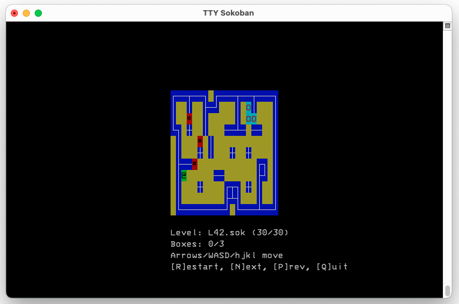

# TTY Sokoban



A terminal-based Sokoban game written in C using the ncurses library.

## Description

TTY Sokoban is a simple implementation of the classic Sokoban puzzle game for terminal/TTY environments.
The game features ASCII line drawing for walls, making it visually appealing in terminal environments.

## Features

- ASCII line drawing for walls
- Embedded levels (no external files needed)
- Simple and intuitive controls
- Support for multiple levels

## Requirements

- C compiler (like GCC)
- ncurses library

## Building

```
make
```

This will:
1. Compile the embed_levels tool
2. Generate the embedded_levels.h file from levels in the levels/ directory
3. Compile the game with the embedded levels

## Running the Game

```
./ttysokoban
```

## Game Controls

- Movement:
  - Arrow keys: Move the player
  - WASD keys: Alternative movement (W=up, A=left, S=down, D=right)
  - hjkl keys: Vi-style movement (h=left, j=down, k=up, l=right)
- r: Restart the current level
- n: Go to the next level
- p: Go to the previous level
- q: Quit the game

## Level Format

The game uses the "sokohard" level format from https://github.com/mezpusz/sokohard

Character representations:
- `#`: Box (originally wall, now used for boxes)
- ` `: Empty space
- `@`: Player
- `+`: Player on goal
- `$`: Box (in level files)
- `*`: Box on goal
- `.`: Goal

Walls are displayed using ASCII line drawing characters for a more visually appealing experience.

## Adding Custom Levels

1. Place your .sok level files in the `levels/` directory
2. Run `./embed_levels` to update the embedded levels, or simply run `make update`
3. Recompile with `make`

## Generating New Levels

The game includes a script to generate new levels using the sokohard level generator:

```
./generate_level.sh
```

This script will:
1. Generate 42 progressively more difficult levels
2. Save them to the `levels/` directory as `Gen01.sok` through `Gen42.sok`
3. Automatically update the embedded levels if possible

The generated levels have increasing width, height, and box count as difficulty increases. Even-numbered levels use the box-changes metric (number of box pushes), while odd-numbered levels use the player-moves metric.

To use the generated levels in the game, run:

```
make update
```

## Credits

This game uses level format and concepts from the sokohard project:
https://github.com/mezpusz/sokohard